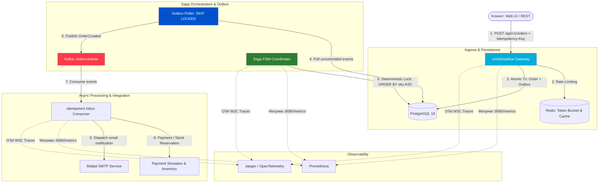

<div align="center">

<!-- Animated SVG Header -->


<!-- Badges -->
<p>
  
  
  
  
  
  
  
  
  
</p>

<!-- Quick Stats -->
<table>
  <tr>
    <td align="center"><strong>📦</strong></td>
    <td align="center"><strong>🔁</strong></td>
    <td align="center"><strong>🛡️</strong></td>
    <td align="center"><strong>📊</strong></td>
  </tr>
  <tr>
    <td align="center">Transactional Outbox & Saga FSM</td>
    <td align="center">Kafka Inbox Deduplication</td>
    <td align="center">Zero Overselling & Zero Floats</td>
    <td align="center">Prometheus + OTel Tracing</td>
  </tr>
</table>

</div>

---

## 🚀 О проекте

**ShopFlow** — это высоконадежная, событийно-ориентированная платформа обработки заказов корпоративного уровня, реализованная в виде **модульного монолита** на языке **Go**.

Система спроектирована по принципам **Clean Architecture** и **Domain-Driven Design (DDD)** для работы в условиях высоких нагрузок (High-Load) и решает ключевые проблемы распределенных транзакций:
- **Zero Overselling**: исключение оверселлинга при конкурентных всплесках заказов с помощью детерминированной блокировки строк PostgreSQL (`SELECT ... FOR UPDATE ORDER BY sku ASC`).
- **Transactional Outbox & Inbox**: гарантия атомарности записи в БД и публикации событий в Kafka без потери данных и дубликатов.
- **Saga Orchestrator**: координация распределенных шагов оформления заказа (резервация стока -> платеж -> подтверждение -> компенсации при сбоях) через персистентный конечный автомат (FSM) в PostgreSQL.
- **Strict Money Invariant**: все денежные расчеты и цены ведутся строго в целочисленных единицах `int64` minor units (копейки/центы) с валютами ISO-4217, полностью исключая ошибки точности `float`.

---

## ✨ Ключевые особенности

<table>
<tr>
<td width="50%">

### 📦 Transactional Outbox & Inbox
- **Атомарная транзакция**: сохранение заказа и регистрация события в Outbox в едином транзакционном коммите
- **`SELECT ... FOR UPDATE SKIP LOCKED`**: параллельный фоновый опрос без взаимоблокировок реплик
- **Idempotent Inbox**: дедупликация входящих событий по составному ключу `(message_id, consumer_group)`

</td>
<td width="50%">

### 🛡️ Детерминированный Stock Lock
- **Анти-дедлок механизм**: блокировка строк склада строго по возрастанию SKU (`ORDER BY sku ASC`)
- **Zero Overselling**: подтверждено k6 стресс-тестом на 100 одновременных заказов на 10 остатков (ровно 10 успехов, 90 отказов, 0 дефицита)
- **Таймаут-компенсация**: автоматический возврат заблокированных резервов фоновым Saga Watchdog

</td>
</tr>
<tr>
<td width="50%">

### ⚡ Кэш и Rate Limiter на Redis
- **Catalog Cache-Aside**: TTL с джиттером (±30с) от thundering herd и дедупликация чтений через `singleflight`
- **Sliding Window Token Bucket**: атомарный Rate Limiter на Redis Lua скриптах с раздельными лимитами по роутам
- **Graceful Degradation**: политики `FailOpen` (для чтения каталога) и `FailClosed` (для заказов)

</td>
<td width="50%">

### 🔍 Поиск, Медиа & Наблюдаемость
- **OpenSearch**: полнотекстовый поиск с бустингом названий (`title^3`) и фасетными фильтрами категорий/цен
- **S3 / MinIO**: надежное хранение изображений товаров с лимитом 5МБ и компенсацией при сбоях БД
- **Observability**: сквозной W3C трейсинг (OpenTelemetry), метрики Prometheus и K8s `/health` пробы

</td>
</tr>
</table>

---

## 🏗️ Архитектура и поток распределенной саги

<div align="center">



</div>

---

## 📁 Структура проекта

```
shopflow/
├── 📁 cmd/
│   ├── 📁 shopflow/              # Основная точка входа монолитного бэкенд-сервера
│   │   └── main.go
│   └── 📁 migrate/               # Автономный раннер миграций БД (Goose)
│       └── main.go
├── 📁 api/
│   ├── 📁 openapi/               # OpenAPI 3.1 спецификации REST API
│   ├── 📁 proto/                 # Protobuf определения (Buf)
│   └── 📁 events/                # CloudEvents JSON-схемы для топиков Kafka
├── 📁 internal/
│   ├── 📁 domain/                # Изолированные доменные модули (Clean Architecture)
│   │   ├── 📁 money/             # Строгий int64 Value Object для денег (zero floats)
│   │   ├── 📁 catalog/           # Товары, категории, изображения и поиск
│   │   ├── 📁 cart/              # Сессии корзин и Optimistic Concurrency Control (OCC)
│   │   ├── 📁 order/             # Заказы, снимки цен и серверные расчеты
│   │   ├── 📁 inventory/         # Склад, детерминированные блокировки строк и резервации
│   │   ├── 📁 saga/              # Оркестратор распределенной Саги в PostgreSQL (FSM)
│   │   ├── 📁 outbox/            # Transactional Outbox паблишер (SKIP LOCKED)
│   │   ├── 📁 inbox/             # Idempotent Inbox консьюмер (дедупликация)
│   │   ├── 📁 payment/           # Идемпотентная обработка платежей и возвратов
│   │   └── 📁 notification/      # Email-уведомления через Mailpit по событиям Kafka
│   └── 📁 platform/              # Инфраструктурные адаптеры
│       ├── 📁 cache/             # Redis Cache-Aside с singleflight и jitter TTL
│       ├── 📁 ratelimit/         # Redis Token Bucket Rate Limiter (Lua)
│       ├── 📁 storage/           # S3/MinIO & InMemory BlobStorage адаптеры
│       ├── 📁 search/            # OpenSearch клиент и индексация каталога
│       ├── 📁 email/             # SMTP (Mailpit) отправка HTML/Text писем
│       ├── 📁 telemetry/         # OpenTelemetry трейсинг, Prometheus метрики и health-пробы
│       └── 📁 web/               # HTTP роутинг, JSON-хелперы и отдача статики SPA
├── 📁 web/                       # Frontend SPA (React 18 + Vite + TypeScript + Tailwind CSS)
├── 📁 deploy/
│   └── 📁 helm/shopflow/         # Production Helm-чарт (Deployment, HPA, PDB, Ingress)
├── 📁 test/
│   ├── 📁 e2e/                   # 4 уровня E2E тестов с Testcontainers (Postgres, Kafka)
│   └── 📁 load/                  # k6 скрипты стресс-тестов на оверселлинг и BENCHMARK.md
├── 📁 migrations/                # SQL миграции базы данных (Goose)
├── docker-compose.yml            # Локальная инфраструктура (Postgres, Kafka, Redis, MinIO, OpenSearch, Mailpit)
├── Dockerfile                    # Multi-stage production контейнер (<50MB, non-root UID 10001)
├── Makefile                      # Команды сборки, тестирования, линтинга и запуска
└── README.md                     # Документация проекта
```

---

## 🛠️ Технологический стек

<div align="center">

| Технология | Назначение |
|:----------:|------------|
|  | **Golang 1.26** — основной язык backend разработки, `log/slog` |
|  | **PostgreSQL 16** — реляционная БД, `pgxpool`, транзакционный Outbox, Saga FSM |
|  | **Apache Kafka (KRaft)** — событийно-ориентированный брокер (`franz-go`) |
|  | **Redis 7** — кэширование каталога, singleflight, sliding window token bucket rate limit |
|  | **OpenSearch** — полнотекстовый поиск товаров со взвешиванием и фасетами |
|  | **React 18 + Vite + TS** — современный клиентский веб-интерфейс |
|  | **Kubernetes & Helm** — отказоустойчивый деплой, автоскейлинг HPA, бюджет PDB |
|  | **OpenTelemetry & Prometheus** — сквозная трассировка (W3C), технические и бизнес-метрики |
|  | **Docker & Compose** — контейнеризация локального окружения |

</div>

---

## 🚀 Быстрый старт

### Предварительные требования
- Установленный **Go 1.24+**
- Установленный **Docker & Docker Compose**
- **Node.js 20+** (для сборки фронтенда, опционально)

### 1. Клонирование и запуск инфраструктуры
```bash
# Клонируйте репозиторий
git clone https://github.com/Masterfar7/shopflow.git
cd shopflow

# Поднимите все сервисы инфраструктуры в Docker
docker compose up -d
```
*Поднимаются: PostgreSQL 16, Apache Kafka KRaft, Redis 7, MinIO S3, OpenSearch и Mailpit.*

### 2. Применение миграций базы данных
```bash
go run ./cmd/migrate up
```

### 3. Запуск монолитного сервера ShopFlow
```bash
go run ./cmd/shopflow
```
*Сервер запустится на порту `8080`, предоставляя REST API (`/api/v1/*`), встроенный Web SPA и метрики (`/metrics`).*

---

## 📡 Примеры вызовов API

### 1️⃣ Поиск товаров с фасетами (OpenSearch)
```bash
curl -X GET "http://localhost:8080/api/v1/products/search?q=pro&min_price=1000&limit=10"
```

### 2️⃣ Добавление товара в корзину (с контролем версий OCC)
```bash
curl -X POST http://localhost:8080/api/v1/cart/items \
  -H "Content-Type: application/json" \
  -H "X-Cart-ID: 11111111-1111-1111-1111-111111111111" \
  -H "If-Match: 1" \
  -d '{
    "sku": "SKU-LAPTOP-01",
    "quantity": 1
  }'
```

### 3️⃣ Атомарное оформление заказа (Saga Orchestration)
```bash
curl -X POST http://localhost:8080/api/v1/orders \
  -H "Content-Type: application/json" \
  -H "Idempotency-Key: req-order-998811" \
  -d '{
    "customer_id": "00000000-0000-0000-0000-000000000001",
    "items": [
      {
        "sku": "SKU-LAPTOP-01",
        "quantity": 1
      }
    ]
  }'
```
*При создании заказ получает статус `PENDING`, регистрируется в Outbox, после чего Saga FSM атомарно блокирует инвентарь и подтверждает платеж.*

### 4️⃣ Проверка статуса заказа
```bash
curl http://localhost:8080/api/v1/orders/<ORDER_ID>
```
*Статус переходит в `CONFIRMED`, а покупателю через Mailpit отправляется письмо-подтверждение.*

---

## 📊 Мониторинг, Web UI и дашборды

| Сервис | Адрес | Назначение |
|:-------|:------|:-----------|
| 🛒 **Web Frontend SPA** | [http://localhost:8080](http://localhost:8080) | Клиентская витрина магазина, корзина и отслеживание Saga |
| 📧 **Mailpit UI** | [http://localhost:8025](http://localhost:8025) | Просмотр отправленных транзакционных писем (HTML/Text) |
| 🪣 **MinIO Console** | [http://localhost:9001](http://localhost:9001) | Управление бакетом медиа-ассетов (`shopflow-media`) |
| 📈 **Метрики Prometheus** | [http://localhost:8080/metrics](http://localhost:8080/metrics) | Технические и бизнесовые счетчики, latency гистограммы |
| 🩺 **Health Probes** | [http://localhost:8080/health/ready](http://localhost:8080/health/ready) | Проверка готовности (DB, Redis, Kafka) для Kubernetes |

---

## 🧪 Запуск тестов и бенчмарков

```bash
# 1. Запуск всех модульных тестов с проверкой отсутствия гонок
go test -race ./internal/...

# 2. Статический анализ кода
go vet ./...

# 3. Стресс-тест k6 на оверселлинг (100 одновременных заказов на 10 остатков)
k6 run test/load/overselling_stress.js

# 4. Стресс-тест k6 на проверку Rate Limiter'а Redis
k6 run test/load/search_rate_limit.js
```

Подробные результаты нагрузочных тестов и доказательство физической сохранности остатков задокументированы в [`test/load/BENCHMARK.md`](test/load/BENCHMARK.md).

<div align="center">

<!-- Animated Footer -->


</div>
